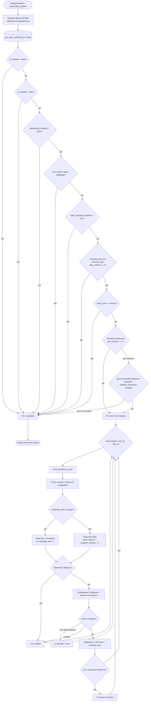

# YogaDailyBot

Telegram бот с йога-практиками, который работает в Railway и использует Railway Postgres.

## 🎯 Описание

YogaDailyBot помогает пользователям практиковать регулярно: в режиме Daily бот присылает практики по расписанию, а в режиме By mood подбирает практику по текущему запросу пользователя. Бот работает через Telegram long polling, хранит данные в PostgreSQL и деплоится в Railway.

## 🚀 Возможности

- ✅ **Daily режим** - ежедневная отправка практик в выбранное время
- ✅ **By mood режим** - подбор практики по настроению/запросу без расписания
- ✅ **Персонализация** - выбор режима, времени и паузы рассылки
- ✅ **Прогресс** - отслеживание выполненных практик
- ✅ **Админ-рассылки** - массовые сообщения пользователям
- ✅ **Railway Postgres** - рабочая база данных в Railway

## 🛠️ Технологии

- **Python 3.11**
- **python-telegram-bot** - для работы с Telegram API
- **PostgreSQL** - облачная база данных
- **psycopg2** - драйвер для PostgreSQL
- **APScheduler** - планировщик задач
- **Railway** - production hosting
- **Dockerfile** - production build для Railway

## 📋 Требования

- Railway project с service `YogaDailyBot`
- Railway Postgres service
- Telegram Bot Token
- Для локального теста: Python 3.11 и `venv`

## 🔧 Локальная разработка и тестовый бот

### 1. Клонирование репозитория

```bash
git clone <repository-url>
cd YogaDailyBot
```

### 2. Создание виртуального окружения

```bash
python3 -m venv venv
source venv/bin/activate  # Linux/Mac
# или
venv\Scripts\activate     # Windows
```

### 3. Установка зависимостей

```bash
pip install -r requirements.txt
```

### 4. Настройка тестового окружения

Для локального тестового бота используйте отдельный env-файл, чтобы не смешивать тест и production:

```bash
cp test/env.test.example test/.env.test
```

Заполните `test/.env.test` тестовым токеном и тестовой/локальной БД:

```env
BOT_TOKEN=your_bot_token_here
DEFAULT_TZ=Europe/Moscow
LOG_LEVEL=INFO
POSTGRESQL_HOST=your-postgres-host
POSTGRESQL_PORT=5432
POSTGRESQL_USER=your_username
POSTGRESQL_PASSWORD=your_password
POSTGRESQL_DBNAME=your_database_name
POSTGRES_SSLMODE=require
```

### 5. Локальный запуск

```bash
ENV_FILE=test/.env.test python -m app.main
```

## 🚀 Production Deploy: Railway

Production окружение живёт в Railway:

- service `YogaDailyBot` собирается из корневого `Dockerfile`;
- service `Postgres` хранит рабочую БД;
- бот работает через long polling, публичный webhook URL не нужен.

### Railway Variables

В `Railway -> YogaDailyBot -> Variables` должны быть заданы:

```env
BOT_TOKEN=<production Telegram bot token>
DEFAULT_TZ=Europe/Moscow
LOG_LEVEL=INFO

POSTGRESQL_HOST=<Railway Postgres public/internal host>
POSTGRESQL_PORT=<Railway Postgres port>
POSTGRESQL_USER=<Railway Postgres user>
POSTGRESQL_PASSWORD=<Railway Postgres password>
POSTGRESQL_DBNAME=<Railway Postgres database>
POSTGRES_SSLMODE=require
```

### Как выкатывается production

1. Изменения попадают в ветку `main`.
2. Railway автоматически запускает новый deploy.
3. Проверяем `Deploy Logs`: должно быть `Application started`, без `Traceback`/`ERROR`.
4. Делаем smoke-test в Telegram: `/start`, выбор режима, сохранение времени/By mood.

## 📣 Одноразовая рассылка со старого бота

Для уведомления старых пользователей о переезде используется ручной скрипт:

```bash
tools/broadcast_old_bot_migration.py
```

Он:
- берёт получателей из последнего архива старых пользователей в Railway DB;
- отправляет только пользователям, у которых `is_blocked` не равен `true`;
- использует отдельную переменную `OLD_BOT_TOKEN`;
- не связан с Railway deploy и не запускается автоматически.

Dry-run без реальной отправки:

```bash
DATABASE_URL="<railway_postgres_url>" python tools/broadcast_old_bot_migration.py --limit 5
```

Тестовая отправка одному пользователю:

```bash
DATABASE_URL="<railway_postgres_url>" \
OLD_BOT_TOKEN="<old_bot_token>" \
python tools/broadcast_old_bot_migration.py --send --confirm SEND --user-id <telegram_user_id>
```

Массовая отправка:

```bash
DATABASE_URL="<railway_postgres_url>" \
OLD_BOT_TOKEN="<old_bot_token>" \
python tools/broadcast_old_bot_migration.py --send --confirm SEND
```

Отчёты сохраняются в `broadcast_reports/` и не коммитятся в git.

## 📬 Ежедневная рассылка практик (as is)

Сейчас в production планировщик каждую минуту запускает `send_daily_practice`, а кандидаты на отправку выбираются через `get_users_pending_for_today`. Ниже зафиксирована текущая логика как есть (без изменений и оптимизаций), чтобы безопасно пройти период челленджа.



## 📊 Структура базы данных

### Таблица `users`

Идентификация и контакты
- `user_id` - ID пользователя в Telegram (PRIMARY KEY)
- `chat_id` - ID чата
- `user_name` - имя пользователя
- `user_nickname` - username пользователя

Режим и расписание
- `bot_mode` - текущий режим: `pending` (не выбран), `daily`, `by_mood`, `challenge`
- `daily_schedule_enabled` - включена ли ежедневная рассылка
- `notify_time` - время уведомлений в Daily/Challenge (HH:MM)
- `onboarding_required` - нужно ли пройти онбординг (после /start и при смене режима)
- `challenge_start_id` - стартовая практика челленджа (NULL, если не в челлендже)
- `challenge_day` - текущий день челленджа

Прогресс
- `total_practices` - всего отправлено практик во всех режимах (M в «N из M»)
- `program_position` - техническая позиция в Daily-программе
- `last_practice_message_id` - id последнего сообщения с кнопкой «✅ Я сделал!» (чтобы снимать кнопку при новой отправке)
- `extra_practices_inline_messages` - JSONB-список сообщений «Еще практики» (снимаются при смене режима)

Пауза Daily-рассылки
- `is_paused` - сейчас ли на паузе
- `paused_at` - когда поставил паузу (для логики «первое напоминание через 7 дней»)
- `last_pause_reminder_at` - время последнего pause-напоминания
- `pause_reminder_step` - индекс ротации фраз pause-напоминаний

Неактивность в By mood
- `last_by_mood_active_at` - последняя активность в By mood (активация режима или отправка практики)
- `last_by_mood_reminder_at` - время последнего By mood-напоминания
- `by_mood_reminder_step` - индекс ротации фраз By mood-напоминаний

Технические
- `is_blocked` - заблокировал ли пользователь бота (помечается при ошибке отправки)
- `created_at` - дата регистрации
- `updated_at` - дата последнего обновления

### Таблица `yoga_practices`
- `practices_id` - уникальный ID практики
- `title` - название видео
- `video_url` - ссылка на YouTube
- `time_practices` - длительность в минутах
- `channel_name` - название канала
- `description` - описание видео
- `my_description` - дополнительное описание
- `intensity` - интенсивность (легкая/средняя/высокая)
- `weekday` - день недели (1-7, NULL для любого дня)
- `created_at` - дата добавления
- `updated_at` - дата последнего обновления

### Таблица `practice_logs`
- `log_id` - уникальный ID лога
- `user_id` - ID пользователя
- `practice_id` - ID практики
- `sent_at` - время отправки
- `day_number` - номер отправки в общем счётчике (`total_practices`), для By mood используется служебное значение `-1`
- `completed_at` - дата отметки выполнения

### Таблица `by_mood_seen`
- `user_id` - ID пользователя
- `filter_key` - выбранный фильтр By mood
- `practice_id` - отправленная практика
- `sent_at` - дата отправки

## 🎮 Команды бота

### Команды для пользователей

- `/start` - запускает онбординг: знакомство с ботом и выбор режима.
- `/help` - отвечает на частые вопросы и показывает, куда написать по ошибкам, идеям и общению.
- `/progress` - показывает прогресс выполненных практик («N из M»), сравнение с другими пользователями и кнопку сброса прогресса.
- `/suggest` - предложить свою практику с YouTube: бот просит ссылку и необязательный комментарий одним сообщением.
- `/donate` - способы поддержать проект: перевод на карту или Telegram Stars.

- `/change_mode` - позволяет заново выбрать Daily или By mood.
- `/challenge <id>` - включает режим челленджа, где практики идут последовательно, начиная с указанного `id` практики (пример: `/challenge 54`).
- `/challenge_off` - выключает режим челленджа и возвращает обычную логику отправки практик.

### Служебные команды (в основном для разработки/тестов)

- `/test` - отправляет тестовую практику сразу, чтобы проверить работу рассылки.
- `/myid` - показывает техническую информацию пользователя (`user_id` и `chat_id`) для отладки.

### Админ-команды (доступны только администратору)

- `/secret` - запускает массовую рассылку всем пользователям (текст или фото с подписью).
- `/secret_delete` - удаляет последнюю массовую рассылку у пользователей.
- `/secret_edit` - редактирует текст/подпись последней массовой рассылки.

## ⏰ Напоминания в боте

Ниже сводка всех автосообщений-напоминаний, которые отправляет бот.

| Сценарий | Триггер | Когда приходит | Текст напоминания |
|---|---|---|---|
| Выбор режима после `/start` (1-е) | `/start`, режим не выбран (`bot_mode = pending`) | Через **1 час** после `/start` | `Чтобы бот начал работать, тебе нужно *выбрать режим*.\nОпределяйся: *Daily* или *By mood* — и погнали 🧡` — кнопки «Посмотреть пример» / «Выбрать режим» |
| Выбор режима после `/start` (2-е) | То же условие | Через **24 часа** после `/start` | `Ты все еще не выбрал режим...\n\nНажми *Daily* или *By mood* — это займёт один миг` — кнопки *Daily* / *By mood* |
| Выбор режима после «Выбрать режим» (1-е) | Нажал «Выбрать режим», но не нажал *Daily* / *By mood* | Через **1 час** после экрана выбора режима | Тот же текст, что после `/start` (1-е) — кнопки *Daily* / *By mood* |
| Выбор режима после «Выбрать режим» (2-е) | То же условие | Через **24 часа** после экрана выбора режима | Тот же текст, что после `/start` (2-е) — кнопки *Daily* / *By mood* |
| Ввод времени: Daily/Challenge без кнопки (1-е) | Выбрал Daily/Challenge, **не нажал** «Выбрать время» | Через **1 час** после сообщения с кнопкой | `Мы уже почти готовы...` + `*Введи время в формате ЧЧ.ММ*` — **без кнопки**; с прошлого сообщения кнопка снимается |
| Ввод времени: Daily/Challenge без кнопки (2-е) | То же условие | Через **24 часа** | `Эй, мы так и не начали...` + `*Введи время...*` — **без кнопки** |
| Ввод времени: после «Выбрать время» (1-е) | Нажал «Выбрать время», но **не ввёл** время | Через **1 час** после нажатия кнопки | Тот же текст про ввод времени — **без кнопки** |
| Ввод времени: после «Выбрать время» (2-е) | То же условие | Через **24 часа** | Тот же текст про ввод времени — **без кнопки** |
| Не нажата кнопка `✅ Я сделал!` | Практика отправлена **до 19:30 МСК**, но не отмечена как выполненная | В **19:30 МСК** того же дня | **Случайный текст** из пула: `Практика все еще ждет тебя 🧡` / `Кажется ты кое-что забыл...Самое время расстилать коврик!` / `Кнопка «✅ Я сделал!» ждет нажатий` / `Прогресс сам себя не увеличит - как выполнишь практику, жми ✅` / `«✅ Я сделал!» — самая недооценённая кнопка в чате` / `Похоже, практика осталась невыполненной, но все еще можно исправить` |
| Пауза Daily/Challenge | Пользователь поставил рассылку на паузу (`is_paused = true`) | Не чаще **1 раза в 7 дней** (проверка кандидатов каждые 6 часов) | **Ротация фраз** из `PAUSE_REMINDER_TEXTS`, например: `Пауза затянулась 💔`, `Скучаю по твоим практикам 🧘‍♂️`, `Я не пишу «вернись», я пишу «как ты там»` |
| Неактивность в By mood | Пользователь в режиме By mood и не запрашивал практики **7+ дней** | Не чаще **1 раза в 7 дней** (проверка кандидатов каждые 6 часов) | **Ротация фраз** из `BY_MOOD_REMINDER_TEXTS`, например: `Пауза затянулась 💔`, `Я все еще думаю о тебе 📆`, `Я изменился: стал мягче, стабильнее и с хорошим расписанием ✨` |

## 📈 Мониторинг

Бот автоматически логирует:
- Подключения к базе данных
- Отправку практик пользователям
- Ошибки и исключения
- Статистику использования

## 🔒 Безопасность

- Все пароли и токены хранятся в переменных окружения
- Подключение к PostgreSQL через SSL
- Валидация входных данных
- Логирование всех операций

## 🤝 Разработка

### Структура проекта

```
YogaDailyBot/
├── app/
│   ├── by_mood/       # By mood подбор практик
│   ├── handlers/      # Обработчики команд и кнопок
│   ├── schedule/      # Планировщик Daily-рассылки
│   ├── main.py        # Entrypoint
│   ├── keyboards.py   # Клавиатуры
│   └── config.py      # Конфигурация из env
├── data/
│   ├── db.py          # Основной модуль БД
│   └── postgres_db.py # PostgreSQL функции и миграции
├── test/              # Локальный тестовый запуск и тестовые шаблоны env
├── Dockerfile         # Railway production build
└── requirements.txt   # Python зависимости
```

### Добавление новых функций

1. Создайте обработчик в `app/handlers/`
2. Добавьте команду в `app/main.py`
3. При необходимости обновите базу данных
4. Протестируйте функциональность

## 🧹 Legacy deploy

Старый Kubernetes/Timeweb deploy удалён. Актуальный production-путь один: Railway auto deploy из `main`.


## 📞 Поддержка

Если у вас возникли вопросы или проблемы:

1. Проверьте логи бота
2. Убедитесь, что все переменные окружения настроены
3. Проверьте подключение к базе данных
4. Создайте issue в репозитории

## 📄 Лицензия

Этот проект распространяется под лицензией MIT.

---

**Удачной практики! 🧘‍♀️**
