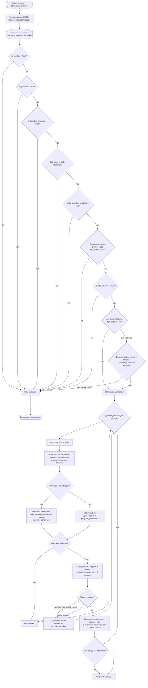
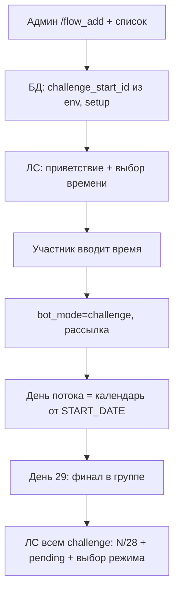

# YogaDailyBot

Telegram бот с йога-практиками, который работает в Railway и использует Railway Postgres.

## Содержание

- [Описание](#-описание)
- [Возможности](#-возможности)
- [Технологии](#-технологии)
- [Требования](#-требования)
- [Локальная разработка и тестовый бот](#-локальная-разработка-и-тестовый-бот)
- [Production Deploy: Railway](#-production-deploy-railway)
- [Ежедневная рассылка практик (as is)](#-ежедневная-рассылка-практик-as-is)
- [Структура базы данных](#-структура-базы-данных)
  - [Таблица](#таблица-users) `users`
  - [Таблица](#таблица-yoga_practices) `yoga_practices`
  - [Таблица](#таблица-practice_logs) `practice_logs`
  - [Таблица](#таблица-by_mood_seen) `by_mood_seen`
  - [Таблица](#таблица-user_favorites) `user_favorites`
  - [Таблица](#таблица-system_state) `system_state`
- [Метки источников (UTM)](#-метки-источников-utm)
- [Челленджи](#-челленджи)
  - [Поток (календарный режим)](#поток-календарный-режим)
  - [Сводки и расписание в группе](#сводки-и-расписание-в-группе)
- [Избранное](#-избранное)
- [Команды бота](#-команды-бота)
  - [Команды для пользователей](#команды-для-пользователей)
  - [Служебные команды](#служебные-команды-в-основном-для-разработкитестов)
  - [Админ-команды](#админ-команды-доступны-только-администратору)
- [Напоминания в боте](#-напоминания-в-боте)
- [Мониторинг](#-мониторинг)
- [Безопасность](#-безопасность)
- [Разработка](#-разработка)
- [Legacy deploy](#-legacy-deploy)
- [Поддержка](#-поддержка)
- [Лицензия](#-лицензия)


## 🎯 Описание

YogaDailyBot помогает пользователям практиковать регулярно: в режиме Daily бот присылает практики по расписанию, а в режиме By mood подбирает практику по текущему запросу пользователя. Бот работает через Telegram long polling, хранит данные в PostgreSQL и деплоится в Railway.

## 🚀 Возможности

- ✅ **Daily режим** - ежедневная отправка практик в выбранное время
- ✅ **Challenge (поток)** - общий календарный челлендж на 28 дней: запись `/flow_add`, практики по дню потока
- ✅ **By mood режим** - подбор практики по настроению/запросу без расписания
- ✅ **Сводки и расписание в группе** - итоги в 10:10 МСК; воскресенье 20:00 — расписание на неделю; день 29 — финал + автовыход в личку
- ✅ **Персонализация** - выбор режима, времени и паузы рассылки
- ✅ **Прогресс** - отслеживание выполненных практик
- ✅ **Избранное** - сохранение понравившихся практик и просмотр списка через `/favorite` (карусель)
- ✅ **Админ-рассылки** - массовые сообщения пользователям
- ✅ **Метки источников** - откуда пришёл пользователь при первом входе (`?start=` в ссылке на бота)
- ✅ **Railway Postgres** - рабочая база данных в Railway


## 🛠️ Технологии

- **Python 3.11**
- **python-telegram-bot** - для работы с Telegram API
- **PostgreSQL** - облачная база данных
- **psycopg2** - драйвер для PostgreSQL
- **APScheduler** - планировщик задач
- **Railway** - production hosting
- **Dockerfile** - production build для Railway


## 📋 Требования

- Railway project с service `YogaDailyBot`
- Railway Postgres service
- Telegram Bot Token
- Для локального теста: Python 3.11 и `venv`


## 🔧 Локальная разработка и тестовый бот


### 1. Клонирование репозитория

```bash
git clone <repository-url>
cd YogaDailyBot
```


### 2. Создание виртуального окружения

```bash
python3 -m venv venv
source venv/bin/activate  # Linux/Mac
# или
venv\Scripts\activate     # Windows
```


### 3. Установка зависимостей

```bash
pip install -r requirements.txt
```


### 4. Настройка тестового окружения

Для локального тестового бота используйте отдельный env-файл, чтобы не смешивать тест и production:

```bash
cp test/env.test.example test/.env.test
```

Заполните `test/.env.test` тестовым токеном и тестовой/локальной БД:

```env
BOT_TOKEN=your_bot_token_here
DEFAULT_TZ=Europe/Moscow
LOG_LEVEL=INFO
POSTGRESQL_HOST=your-postgres-host
POSTGRESQL_PORT=5432
POSTGRESQL_USER=your_username
POSTGRESQL_PASSWORD=your_password
POSTGRESQL_DBNAME=your_database_name
POSTGRES_SSLMODE=require

# ID группового чата для утренних итогов челленджа (необязательно; пустое = сводки не отправляются)
CHALLENGE_GROUP_CHAT_ID=

# Календарный поток челленджа (обе обязательны, чтобы запускать / записывать в челлендж)
# Для локального теста задаются ЗДЕСЬ (не в Railway). После смены — перезапуск бота.
# CHALLENGE_START_DATE=2026-07-07
# CHALLENGE_START_PRACTICE_ID=54
CHALLENGE_START_DATE=
CHALLENGE_START_PRACTICE_ID=
```

Подробнее про тестовый бот: `[test/TEST_README.md](test/TEST_README.md)`.

### 5. Локальный запуск

```bash
./test/run_test.sh
# или:
ENV_FILE=test/.env.test python -m app.main
```


## 🚀 Production Deploy: Railway

Production окружение живёт в Railway:

- service `YogaDailyBot` собирается из корневого `Dockerfile`;
- service `Postgres` хранит рабочую БД;
- бот работает через long polling, публичный webhook URL не нужен.


### Railway Variables

В `Railway -> YogaDailyBot -> Variables` должны быть заданы:

```env
BOT_TOKEN=<production Telegram bot token>
DEFAULT_TZ=Europe/Moscow
LOG_LEVEL=INFO

POSTGRESQL_HOST=<Railway Postgres public/internal host>
POSTGRESQL_PORT=<Railway Postgres port>
POSTGRESQL_USER=<Railway Postgres user>
POSTGRESQL_PASSWORD=<Railway Postgres password>
POSTGRESQL_DBNAME=<Railway Postgres database>
POSTGRES_SSLMODE=require

# ID группового чата для утренних итогов челленджа (обязательно для сводок в проде)
CHALLENGE_GROUP_CHAT_ID=<telegram_group_chat_id>

# Календарный поток (перед стартом нового челленджа; см. памятку запуска)
CHALLENGE_START_DATE=<YYYY-MM-DD понедельник старта, МСК>
CHALLENGE_START_PRACTICE_ID=<id первой практики потока>
```

Памятка «что сделать перед каждым новым потоком»: `[app/challenge/запуск-нового-потока-челленджа.md](app/challenge/запуск-нового-потока-челленджа.md)`.

### Как выкатывается production

1. Изменения попадают в ветку `main`.
2. Railway автоматически запускает новый deploy.
3. Проверяем `Deploy Logs`: должно быть `Application started`, без `Traceback`/`ERROR`.
4. Делаем smoke-test в Telegram: `/start`, выбор режима, сохранение времени/By mood.


## 📬 Ежедневная рассылка практик (as is)

Сейчас в production планировщик каждую минуту запускает `send_daily_practice`, а кандидаты на отправку выбираются через `get_users_pending_for_today`. Ниже зафиксирована текущая логика как есть (без изменений и оптимизаций), чтобы безопасно пройти период челленджа.


```mermaid
flowchart TD
    START([Каждую минуту: send_daily_practice]) --> NOW[Текущее время HH:MM<br/>таймзона Europe/Moscow]
    NOW --> DB[(get_users_pending_for_today)]

    DB --> F1{is_blocked = false?}
    F1 -->|нет| SKIP[Не в выборке]
    F1 -->|да| F2{is_paused = false?}
    F2 -->|нет| SKIP
    F2 -->|да| F3{onboarding_required = false?}
    F3 -->|нет| SKIP
    F3 -->|да| F4{bot_mode in daily, challenge?}
    F4 -->|нет| SKIP
    F4 -->|да| F5{daily_schedule_enabled = true?}
    F5 -->|нет| SKIP
    F5 -->|да| F6{Сегодня уже есть practice_logs<br/>day_number >= 1?}
    F6 -->|да| SKIP
    F6 -->|нет| F7{notify_time <= сейчас?}
    F7 -->|нет| SKIP
    F7 -->|да| F8{Уже были рассылки<br/>day_number >= 1?}

    F8 -->|да| LIST[В списке на отправку]
    F8 -->|нет, новичок| F9{День настройки времени прошёл?<br/>updated_at раньше сегодня}
    F9 -->|нет, тот же день| SKIP
    F9 -->|да| LIST

    LIST --> LOOP{Для каждого user_id, chat_id}
    LOOP --> SEND[send_practice_to_user]

    SEND --> BTN[Снять «✅ Я сделал!» с прошлого сообщения<br/>кнопка избранного остаётся]
    BTN --> MODE{challenge_start_id задан?}
    MODE -->|да| CH[Практика челленджа:<br/>день = календарный день потока<br/>start_id + cohort_day]
    MODE -->|нет| DAILY[Практика Daily<br/>день недели + program_position + 1]
    CH --> FOUND{Практика найдена?}
    DAILY --> FOUND
    FOUND -->|нет| ERR[Лог ошибки]
    FOUND -->|да| TG[Сообщение в Telegram + кнопки<br/>«🧡 В избранное» и «✅ Я сделал!»]
    TG --> OK{Успех отправки?}
    OK -->|ошибка «bot was blocked»| BLOCK[is_blocked = true<br/>+ событие my_chat_member]
    OK -->|другая ошибка| ERR
    OK -->|да| INC[Инкремент счётчиков + practice_logs<br/>в challenge: challenge_day = день потока]
    INC --> BONUS{Есть бонусные практики?}
    BONUS -->|да| BONUSSEND[Отправить бонусы]
    BONUS -->|нет| LOOP
    BONUSSEND --> LOOP

    SKIP --> END([Конец минутного цикла])
    ERR --> LOOP
    BLOCK --> LOOP
```


## 📊 Структура базы данных


### Таблица `users`

Идентификация и контакты

- `user_id` - ID пользователя в Telegram (PRIMARY KEY)
- `chat_id` - ID чата
- `user_name` - имя пользователя
- `user_nickname` - username пользователя
- `traffic_source` - метка источника первого входа (`?start=`), NULL если неизвестен

Режим и расписание

- `bot_mode` - текущий режим: `pending` (не выбран), `daily`, `by_mood`, `challenge`
- `daily_schedule_enabled` - включена ли ежедневная рассылка
- `notify_time` - время уведомлений в Daily/Challenge (HH:MM)
- `onboarding_required` - нужно ли пройти онбординг (после /start и при смене режима)
- `challenge_start_id` - стартовая практика потока (из `CHALLENGE_START_PRACTICE_ID`; NULL, если не в челлендже)
- `challenge_day` - день потока у пользователя (при календарном режиме синхронизируется с днём от `CHALLENGE_START_DATE` при рассылке)

Прогресс

- `total_practices` - всего отправлено практик во всех режимах (M в «N из M»)
- `program_position` - техническая позиция в Daily-программе
- `last_practice_message_id` - id последнего сообщения с практикой (для снятия «✅ Я сделал!» при новой отправке)
- `last_practice_id` - id практики в этом сообщении (чтобы оставить кнопку избранного на старой карточке)
- `last_practice_catalog` - каталог этой практики (`yoga` / mood; для кнопки избранного на старом сообщении)
- `extra_practices_inline_messages` - JSONB-список сообщений «Еще практики» (снимаются при смене режима)

Пауза Daily-рассылки

- `is_paused` - сейчас ли на паузе
- `paused_at` - когда поставил паузу (для логики «первое напоминание через 7 дней»)
- `last_pause_reminder_at` - время последнего pause-напоминания
- `pause_reminder_step` - индекс ротации фраз pause-напоминаний

Неактивность в By mood

- `last_by_mood_active_at` - последняя активность в By mood (активация режима или отправка практики)
- `last_by_mood_reminder_at` - время последнего By mood-напоминания
- `by_mood_reminder_step` - индекс ротации фраз By mood-напоминаний

Технические

- `is_blocked` - заблокировал ли пользователь бота (событие Telegram my_chat_member и/или ошибка отправки «bot was blocked by the user»)
- `created_at` - дата регистрации
- `updated_at` - дата последнего обновления


### Таблица `yoga_practices`

- `practices_id` - уникальный ID практики
- `title` - название видео
- `video_url` - ссылка на YouTube
- `time_practices` - длительность в минутах
- `channel_name` - название канала
- `description` - описание видео
- `my_description` - дополнительное описание
- `difficulty` - сложность (легкая/средняя/высокая)
- `weekday` - день недели (1-7, NULL для любого дня)
- `created_at` - дата добавления
- `updated_at` - дата последнего обновления


### Таблица `practice_logs`

- `log_id` - уникальный ID лога
- `user_id` - ID пользователя
- `practice_id` - ID практики
- `sent_at` - время отправки
- `day_number` - номер отправки в общем счётчике (`total_practices`), для By mood используется служебное значение `-1`
- `completed_at` - дата отметки выполнения


### Таблица `by_mood_seen`

- `user_id` - ID пользователя
- `filter_key` - выбранный фильтр By mood
- `practice_id` - отправленная практика
- `sent_at` - дата отправки


### Таблица `user_favorites`

Личный список сохранённых практик пользователя.

- `user_id` - ID пользователя
- `practice_id` - ID практики
- `practice_catalog` - каталог практики (сейчас `yoga`; зарезервировано для mood-практик)
- `added_at` - когда добавили в избранное (сортировка: новые первыми)

Ограничение: одна и та же практика не дублируется у пользователя (`UNIQUE` по паре user + practice + catalog).

### Таблица `system_state`

Служебные флаги бота (ключ-значение), не привязанные к конкретному пользователю.

- `key` - название настройки (PRIMARY KEY)
- `value` - значение в текстовом виде

Используется для утренних сводок челленджа:

- `challenge_summary_last_sent_date` — дата последней отправки (защита от дублей в один день)
- `challenge_summary_stopped` — `true` после финальной сводки (день 29); сбрасывается командой `/challenge_summary_reset`
- `challenge_weekly_schedule_last_sent_date` — дата последней отправки воскресного расписания
- `challenge_auto_exit_sent_on` — дата автозавершения в личку на день 29


## 🏷️ Метки источников (UTM)

Отслеживание, **откуда пришёл пользователь** при первом входе в бота.

## Как это работает

1. В посте / био / описании публикуете ссылку с меткой:
   `https://t.me/YogaDailyBot?start=метка`
2. Человек нажимает Start.
3. Бот один раз сохраняет метку в `users.traffic_source` (первый вход).
4. Повторный `/start` или сброс онбординга метку **не меняют**.

Метка есть **только** если человек перешёл по ссылке с `?start=...`.  
Поиск бота по названию, `@username` без параметра или ссылка без `?start=` → `traffic_source` пустой (источник неизвестен).

## Правила имени метки

- Латиница, цифры, `_` или `-`
- Длина до 64 символов
- Рекомендуемый шаблон: `{канал}_{место}` или `{канал}_{место}_{кампания}`

Готовые ссылки для @YogaDailyBot (YouTube / Instagram — сюда и ставьте):

| Где публикуете | Метка | Ссылка |
|----------------|--------|--------|
| YouTube — описание / закреп | `youtube_desc` | `https://t.me/YogaDailyBot?start=youtube_desc` |
| YouTube Shorts | `youtube_shorts` | `https://t.me/YogaDailyBot?start=youtube_shorts` |
| Instagram — био | `ig_bio` | `https://t.me/YogaDailyBot?start=ig_bio` |
| Instagram — сторис | `ig_story` | `https://t.me/YogaDailyBot?start=ig_story` |
| Instagram Reels | `ig_reels` | `https://t.me/YogaDailyBot?start=ig_reels` |

**Telegram:** тег `@YogaDailyBot` удобен, но метку **не передаёт** — в отчёте такие люди попадут в «без метки». Это нормально. Полную ссылку имеет смысл только если хотите отдельно померить конкретный пост/кампанию (кнопка под постом или кликабельный URL):

| Где публикуете | Метка | Ссылка |
|----------------|--------|--------|
| Telegram — канал (опционально) | `tg_channel` | `https://t.me/YogaDailyBot?start=tg_channel` |
| Telegram — чатик (опционально) | `tg_chat` | `https://t.me/YogaDailyBot?start=tg_chat` |
## Поля в БД
| Поле | Смысл |
|------|--------|
| `users.traffic_source` | Метка из ссылки (или NULL) |

Дата первого входа — в обычном поле `users.created_at`.

## Как ставить по площадкам
YouTube
В описание: «Бот с практиками → [https://t.me/YogaDailyBot?start=youtube_desc»](https://t.me/YogaDailyBot?start=youtube_desc»).
Для Shorts — отдельная ссылка с youtube_shorts, иначе Shorts и длинные видео смешаются в отчёте.

Instagram
В обычном посте ленты ссылка не кликабельна — только текст «ссылка в био».
Чтобы отличать: в био держите ig_bio, а в сторис/рилс — свои метки; в тексте рилса пишите «ссылка в био» (люди всё равно попадут как ig_bio, если кликнут био).
Идеально для рилсов/сторис: стикер со ссылкой ig_story / ig_reels.

Telegram
В обычных сообщениях можно просто тегать `@YogaDailyBot` — так удобнее, метки не будет.
Если нужно отдельно померить пост в канале — кнопка или кликабельная ссылка `tg_channel` / `tg_chat`.

Если нужна кампания (разовый запуск)
Добавьте хвост, например:

[https://t.me/YogaDailyBot?start=ig_story_july28](https://t.me/YogaDailyBot?start=ig_story_july28)
[https://t.me/YogaDailyBot?start=youtube_desc_challenge](https://t.me/YogaDailyBot?start=youtube_desc_challenge)
Правило: только латиница, цифры, _ или -, до 64 символов.

## SQL для DBeaver

Сколько пользователей по каждой метке:

```sql
SELECT
    COALESCE(traffic_source, '(без метки)') AS source,
    COUNT(*) AS users_count
FROM users
GROUP BY traffic_source
ORDER BY users_count DESC;
```

Новые за период с разбивкой по источнику:

```sql
SELECT
    COALESCE(traffic_source, '(без метки)') AS source,
    COUNT(*) AS users_count
FROM users
WHERE created_at >= '2026-07-01'
  AND created_at < '2026-08-01'
GROUP BY traffic_source
ORDER BY users_count DESC;
```

Доля без метки:

```sql
SELECT
    COUNT(*) FILTER (WHERE traffic_source IS NULL) AS without_source,
    COUNT(*) FILTER (WHERE traffic_source IS NOT NULL) AS with_source,
    COUNT(*) AS total
FROM users;
```


## 🌀 Челленджи

Общий **календарный** челлендж на 28 дней: у всех один день потока (день 1 = `CHALLENGE_START_DATE`), одна стартовая практика (`CHALLENGE_START_PRACTICE_ID`). Без этих переменных запуск недоступен.

**Где настраивать env**

- **Прод:** Railway → Variables.
- **Локальный тест:** `test/.env.test` (не Railway), затем перезапуск `./test/run_test.sh`.

**Документы**

- Памятка запуска потока: `[app/challenge/запуск-нового-потока-челленджа.md](app/challenge/запуск-нового-потока-челленджа.md)`
- Полная спецификация: `[теория/challenge-cohort-spec.md](теория/challenge-cohort-spec.md)`


### Поток (календарный режим)

**Кратко по сценарию:**

1. Админ настраивает env и при необходимости делает `/challenge_summary_reset`.
2. Запись участников — в основном `/flow_add` (список уже известных боту `@ник` / `user_id`); запасной путь — `/challenge` (пока поток настроен в env).
3. Участник выбирает время рассылки → получает практики по календарю потока (в приветствии — дата старта ДД.ММ). Опоздавшие после старта: практика **сегодня** (в выбранное время или сразу, если время уже прошло).
4. В группе: сводки 10:10 МСК, расписание вс 20:00 МСК (см. [ниже](#сводки-и-расписание-в-группе)).
5. День 29: финал в группе + автозавершение в личку (результат N/28 + выбор режима). Досрочный выход — `/challenge_off`.


```mermaid
flowchart TD
  admin["Админ /flow_add + список"]
  dbSetup["БД: challenge_start_id из env, setup"]
  dmWelcome["ЛС: приветствие + выбор времени"]
  userTime["Участник вводит время"]
  active["bot_mode=challenge, рассылка"]
  cohortDay["День потока = календарь от START_DATE"]
  day29["День 29: финал в группе"]
  autoOff["ЛС всем challenge: N/28 + pending + выбор режима"]

  admin --> dbSetup --> dmWelcome --> userTime --> active
  active --> cohortDay
  cohortDay --> day29 --> autoOff
```


**Запасной** `/challenge`**:** доступен, пока в env задан поток (`CHALLENGE_START_`*). Отдельного календарного окна записи нет — команда не в меню бота, только ручной запасной путь. Если поток не настроен — пользователь видит «Запись… закрыта» (без технических деталей). Админ через `/flow_add` записывает в любой момент; если env не заданы — админ видит техническое сообщение про настройки.

### Сводки и расписание в группе

Группа задаётся `CHALLENGE_GROUP_CHAT_ID`. Бот должен быть в группе и иметь право писать.

**Автоотправка** (не команды в Telegram) — фоновые задачи из `app/challenge/jobs.py`:


| Что                                                          | Когда                                                                                                                                                   | Код                                               |
| ------------------------------------------------------------ | ------------------------------------------------------------------------------------------------------------------------------------------------------- | ------------------------------------------------- |
| Утренняя сводка (ежедневная / промежуточная / **финальная**) | каждый день **10:10 МСК**                                                                                                                               | `summary/job.py` + тексты в `summary/messages.py` |
| Расписание на неделю                                         | **вс 20:00 МСК** (в т.ч. воскресенье **перед** понедельником старта → дни 1–7). Нужны настроенный поток и группа; **активные участники не обязательны** | `week_schedule/job.py`                            |
| Автозавершение в личку                                       | день **29**, после финальной сводки (или в то же окно 10:10)                                                                                            | `flow/exit_job.py`                                |


Отдельной «команды финальной сводки» нет: в день 29 та же утренняя задача выбирает финальный текст. Админ-команды `/challenge_summary_preview` и `/challenge_schedule_preview` — только ручной прогон для теста; `/challenge_summary_reset` — сброс флагов перед новым потоком.

**Кто считается участником сводки:** пользователи с `bot_mode = challenge`, заданным `challenge_start_id`, без паузы, блокировки и незавершённого онбординга. Основной способ записи — админ `/flow_add`.

**Как считается выполнение (ежедневная сводка):** нажали «✅ Я сделал!» **вчера** (любая практика) **или** отметили практику челленджа, **отправленную вчера** — в том числе утром следующего дня, пока сегодняшняя ещё не пришла.

**Промежуточные итоги (дни 8, 15, 22):** N/M — выполнено за **все прошедшие дни, кроме сегодняшнего** (сводка в 15-й день: «10/14 дней»). Засчёт — как в ежедневной сводке.

**Типы сообщений** (по календарному дню потока):


| День челленджа           | Что в посте                                                                                                         |
| ------------------------ | ------------------------------------------------------------------------------------------------------------------- |
| 1–6                      | Итоги за вчера: сколько и кто выполнил                                                                              |
| 8, 15, 22 (понедельники) | Промежуточный прогресс N/M (без сегодняшнего дня) + «Вы прекрасны! Продолжайте!»                                    |
| 28 (воскресенье)         | Итоги за вчера (последний день практик)                                                                             |
| 29 (понедельник)         | Финальные итоги в группе + **автозавершение в личку** всем с `bot_mode = challenge` (результат N/28 + выбор режима) |
| После 29                 | Сводки не отправляются, пока админ не выполнит `/challenge_summary_reset`                                           |


Имена в сводке: `@nickname`, если есть; иначе `user_name`.

Если `CHALLENGE_GROUP_CHAT_ID` пустой или нет активных участников челленджа — сводка молча пропускается (на день 29 автозавершение в личку всё равно выполняется).

## 🧡 Избранное

Пользователь может сохранять понравившиеся практики и возвращаться к ним в любой момент — во всех режимах (Daily, Challenge, By mood).

Подробная спецификация: `[теория/favorites-spec.md](теория/favorites-spec.md)`.

### Как сохранить практику

Под **основной** практикой (не под бонусной) две кнопки в одном ряду:

```
[ 🧡 В избранное ]   [ ✅ Я сделал! ]
```

Если практика уже в списке — вместо «В избранное» показывается **«🧡 Убрать»**.

Кнопка есть под практиками из:

- ежедневной рассылки (Daily / Challenge);
- By mood (все фильтры, «Сам решу»);
- «Ещё практики».


| Действие | Ответ бота                               |
| -------- | ---------------------------------------- |
| Добавить | Toast: «Добавил практику в избранное 🧡» |
| Убрать   | Toast: «Удалил практику из избранного»   |


### Раздел «Избранное 🧡»

- Команда: `/favorite`
- В меню бота (слева от поля ввода): **«Избранное 🧡»** (первая в списке)

**Пустой список:** подсказка добавить практику кнопкой «🧡 В избранное» под сообщением.

**Есть сохранённые практики:** карусель — одно сообщение, листание стрелками **⬅️ / ➡️** и счётчик **«N / M»**. На карточке:

- заголовок из каталога (`title`);
- время, сложность, канал;
- ссылка на YouTube;
- кнопки **«🧡 Убрать»** / **«🧡 В избранное»** и **«✅ Я сделал!»**.

Порядок в списке: **новые сверху** (по дате добавления).

### «✅ Я сделал!» и кнопка избранного


| Ситуация                       | Поведение                                                                          |
| ------------------------------ | ---------------------------------------------------------------------------------- |
| Нажали «✅ Я сделал!»           | Кнопка «Я сделал!» **исчезает**; «🧡 В избранное» / «🧡 Убрать» **остаётся**       |
| Пришла новая практика          | На **предыдущем** сообщении снимается только «Я сделал!»; избранное **остаётся**   |
| Отметка из карусели избранного | Считается в общий прогресс (streak, счётчик, напоминания) — как для других практик |


### Вне текущей версии

- фильтр «случайная из избранного» в By mood;
- избранное для бонусных практик;
- отдельный пункт в `/help` про избранное.


## 🎮 Команды бота


### Команды для пользователей

- `/start` - запускает онбординг: знакомство с ботом и выбор режима.
- `/help` - отвечает на частые вопросы и показывает, куда написать по ошибкам, идеям и общению.
- `/progress` - показывает прогресс выполненных практик, сравнение с другими; в режиме challenge — ещё строку `Прогресс в челлендже: N/28`. Сброс обнуляет общий прогресс, серию и, во время челленджа, результат `N/28`; перед сбросом бот запрашивает подтверждение.
- `/favorite` - **Избранное 🧡**: карусель сохранённых практик; добавление — кнопкой «🧡 В избранное» под практикой (см. раздел [Избранное](#-избранное)).
- `/suggest` - предложить свою практику с YouTube: бот просит ссылку и необязательный комментарий одним сообщением.
- `/donate` - способы поддержать проект: перевод на карту или Telegram Stars.
- `/change_mode` - позволяет заново выбрать Daily или By mood. В режиме challenge недоступна: бот поясняет, что сменить режим можно после окончания челленджа.
- `/challenge` - запасной ручной вход в текущий поток (id практики из `CHALLENGE_START_PRACTICE_ID`; доступна, пока поток настроен; не в меню бота).
- `/challenge_off` - досрочный выход из челленджа: результат N/28, выбор режима и напоминания как при онбординге.


### Служебные команды (в основном для разработки/тестов)

- `/test` - отправляет тестовую практику сразу, чтобы проверить работу рассылки.
- `/myid` - показывает техническую информацию пользователя (`user_id` и `chat_id`) для отладки.


### Админ-команды (доступны только администратору)

- `/commands` - памятка: список всех команд бота (пользовательские, служебные и админские).
- `/secret` - запускает массовую рассылку всем пользователям (текст или фото с подписью).
- `/secret_delete` - удаляет последнюю массовую рассылку у пользователей.
- `/secret_edit` - редактирует текст/подпись последней массовой рассылки.
- `/flow_add` - массовая запись в поток: следующим сообщением список `@ник` / `user_id` по одному на строку; каждому — приветствие и выбор времени.
- `/challenge_summary_preview` - отправляет сводку челленджа в групповой чат **сразу**, без ожидания 10:10. Не меняет флаги и **не** запускает автозавершение.
- `/challenge_final_resend` - разово пересчитывает исправленные логи и повторно отправляет финал потока 24.08.2026 для зафиксированного состава участников; не меняет режимы и флаги, не отправляет личные сообщения.
- `/challenge_summary_reset` - сбрасывает состояние сводок и автозавершения (`system_state`) для нового потока.
- `/challenge_schedule_preview` - превью воскресного расписания в группу.


## ⏰ Напоминания в боте

Ниже сводка всех автосообщений-напоминаний, которые отправляет бот.


| Сценарий                                       | Триггер                                                                                                | Когда приходит                                                   | Текст напоминания                                                                                                                                                                                                                                                                                                                                                                                                                                                 |
| ---------------------------------------------- | ------------------------------------------------------------------------------------------------------ | ---------------------------------------------------------------- | ----------------------------------------------------------------------------------------------------------------------------------------------------------------------------------------------------------------------------------------------------------------------------------------------------------------------------------------------------------------------------------------------------------------------------------------------------------------- |
| Выбор режима после `/start` (1-е)              | `/start`, режим не выбран (`bot_mode = pending`)                                                       | Через **1 час** после `/start`                                   | `Чтобы бот начал работать, тебе нужно *выбрать режим*.\nОпределяйся: *Daily* или *By mood* — и погнали 🧡` — кнопки «Посмотреть пример» / «Выбрать режим»                                                                                                                                                                                                                                                                                                         |
| Выбор режима после `/start` (2-е)              | То же условие                                                                                          | Через **24 часа** после `/start`                                 | `Ты все еще не выбрал режим...это займёт один миг` — кнопки «Посмотреть пример» / «Выбрать режим»                                                                                                                                                                                                                                                                                                                                                                 |
| Выбор режима после «Выбрать режим» (1-е)       | Нажал «Выбрать режим», но не нажал *Daily* / *By mood*                                                 | Через **1 час** после экрана выбора режима                       | Тот же текст, что после `/start` (1-е) — кнопки *Daily* / *By mood*                                                                                                                                                                                                                                                                                                                                                                                               |
| Выбор режима после «Выбрать режим» (2-е)       | То же условие                                                                                          | Через **24 часа** после экрана выбора режима                     | Тот же текст, что после `/start` (2-е) — кнопки *Daily* / *By mood*                                                                                                                                                                                                                                                                                                                                                                                               |
| Выбор режима после `/change_mode` (1-е)        | Команда `/change_mode`, но не нажал *Daily* / *By mood*                                                | Через **1 час** после экрана выбора режима                       | Тот же текст, что после «Выбрать режим» (1-е) — кнопки *Daily* / *By mood*                                                                                                                                                                                                                                                                                                                                                                                        |
| Выбор режима после `/change_mode` (2-е)        | То же условие                                                                                          | Через **24 часа** после экрана выбора режима                     | Тот же текст, что после «Выбрать режим» (2-е) — кнопки *Daily* / *By mood*                                                                                                                                                                                                                                                                                                                                                                                        |
| Ввод времени: Daily/Challenge без кнопки (1-е) | Выбрал Daily/Challenge, **не нажал** «Выбрать время»                                                   | Через **1 час** после сообщения с кнопкой                        | `Мы уже почти готовы...` + `*Введи время в формате ЧЧ.ММ`* — **без кнопки**; с прошлого сообщения кнопка снимается                                                                                                                                                                                                                                                                                                                                                |
| Ввод времени: Daily/Challenge без кнопки (2-е) | То же условие                                                                                          | Через **24 часа**                                                | `Эй, мы так и не начали...` + `*Введи время...`* — **без кнопки**                                                                                                                                                                                                                                                                                                                                                                                                 |
| Ввод времени: после «Выбрать время» (1-е)      | Нажал «Выбрать время», но **не ввёл** время                                                            | Через **1 час** после нажатия кнопки                             | Тот же текст про ввод времени — **без кнопки**                                                                                                                                                                                                                                                                                                                                                                                                                    |
| Ввод времени: после «Выбрать время» (2-е)      | То же условие                                                                                          | Через **24 часа**                                                | Тот же текст про ввод времени — **без кнопки**                                                                                                                                                                                                                                                                                                                                                                                                                    |
| Не нажата кнопка `✅ Я сделал!`                 | Практика отправлена **до 19:30 МСК**, но не отмечена как выполненная                                   | В **19:30 МСК** того же дня                                      | **Случайный текст** из пула: `Практика все еще ждет тебя 🧡` / `Кажется ты кое-что забыл...Самое время расстилать коврик!` / `Кнопка «✅ Я сделал!» ждет нажатий` / `Прогресс сам себя не увеличит - как выполнишь практику, жми ✅` / `«✅ Я сделал!» — самая недооценённая кнопка в чате` / `Похоже, практика осталась невыполненной, но все еще можно исправить`. **Не приходит**, если пользователь нажал `/start` или `/change_mode`, либо кнопку `✅ Я сделал!` |
| Пауза Daily/Challenge                          | Пользователь поставил рассылку на паузу (`is_paused = true`)                                           | Не чаще **1 раза в 7 дней** (проверка кандидатов каждые 6 часов) | **Ротация фраз** из `PAUSE_REMINDER_TEXTS`, например: `Пауза затянулась 💔`, `Скучаю по твоим практикам 🧘‍♂️`, `Я не пишу «вернись», я пишу «как ты там»`                                                                                                                                                                                                                                                                                                        |
| Неактивность в By mood                         | Пользователь в режиме By mood и не запрашивал практики **7+ дней**                                     | Не чаще **1 раза в 7 дней** (проверка кандидатов каждые 6 часов) | **Ротация фраз** из `BY_MOOD_REMINDER_TEXTS`, например: `Пауза затянулась 💔`, `Я все еще думаю о тебе 📆`, `Я изменился: стал мягче, стабильнее и с хорошим расписанием ✨`                                                                                                                                                                                                                                                                                       |
| Сводка челленджа в группе                      | Есть активные участники челленджа, `CHALLENGE_GROUP_CHAT_ID` задан, сводки не остановлены после финала | Каждый день в **10:10 МСК** (проверка каждую минуту)             | Итоги за вчера; на 8/15/22 дне — промежуточный прогресс; на 29 дне — финальный рейтинг                                                                                                                                                                                                                                                                                                                                                                            |
| Расписание челленджа в группе                  | Поток настроен (`CHALLENGE_START_*`), группа задана, сводки не остановлены; участники не обязательны   | **Вс 20:00 МСК** (в т.ч. день до старта)                         | Список практик на предстоящую неделю потока                                                                                                                                                                                                                                                                                                                                                                                                                       |
| Автозавершение челленджа                       | День потока = 29, ещё не отправлялось сегодня                                                          | **10:10 МСК** (после финальной сводки, если группа есть)         | Всем с `bot_mode = challenge`: результат N/28 + выбор режима + напоминания как после выбора режима                                                                                                                                                                                                                                                                                                                                                                |


## 📈 Мониторинг

Бот автоматически логирует:

- Подключения к базе данных
- Отправку практик пользователям
- Ошибки и исключения
- Статистику использования


## 🔒 Безопасность

- Все пароли и токены хранятся в переменных окружения
- Подключение к PostgreSQL через SSL
- Валидация входных данных
- Логирование всех операций


## 🤝 Разработка


### Структура проекта

```
YogaDailyBot/
├── app/
│   ├── by_mood/       # By mood подбор практик
│   ├── challenge/     # Календарный поток
│   │   ├── cohort.py          # дата старта, день потока, константы 10:10 / вс 20:00
│   │   ├── jobs.py            # регистрация фоновых задач
│   │   ├── summary/           # утренние сводки (job + texts + preview/reset)
│   │   ├── week_schedule/     # воскресное расписание
│   │   ├── flow/              # /flow_add, старт, выход, /challenge, /challenge_off
│   │   └── запуск-нового-потока-челленджа.md
│   ├── daily/         # Daily/Challenge: пауза, время, советы, «Ещё практики»
│   ├── handlers/      # Обработчики команд и кнопок (в т.ч. favorites, done, progress)
│   ├── schedule/      # Планировщик Daily/Challenge-рассылки практик
│   ├── main.py        # Entrypoint
│   ├── keyboards.py   # Клавиатуры
│   ├── practice_markup.py  # Снятие «Я сделал!» с сохранением кнопки избранного
│   └── config.py      # Конфигурация из env
├── data/
│   ├── db.py          # Основной модуль БД
│   └── postgres_db.py # PostgreSQL функции и миграции
├── теория/            # Спеки (challenge-cohort-spec, favorites-spec, …)
├── test/              # Локальный тестовый запуск (run_test.sh, .env.test)
├── scripts/           # Вспомогательные скрипты (напр. чистка сообщений по дате)
├── Dockerfile         # Railway production build
└── requirements.txt   # Python зависимости
```


### Добавление новых функций

1. Создайте обработчик в `app/handlers/`
2. Добавьте команду в `app/main.py`
3. При необходимости обновите базу данных
4. Протестируйте функциональность


## 🧹 Legacy deploy

Старый Kubernetes/Timeweb deploy удалён. Актуальный production-путь один: Railway auto deploy из `main`.

## 📞 Поддержка

Если у вас возникли вопросы или проблемы:

1. Проверьте логи бота
2. Убедитесь, что все переменные окружения настроены
3. Проверьте подключение к базе данных
4. Создайте issue в репозитории


## 📄 Лицензия

Этот проект распространяется под лицензией MIT.

---

**Удачной практики! 🧘‍♀️**
